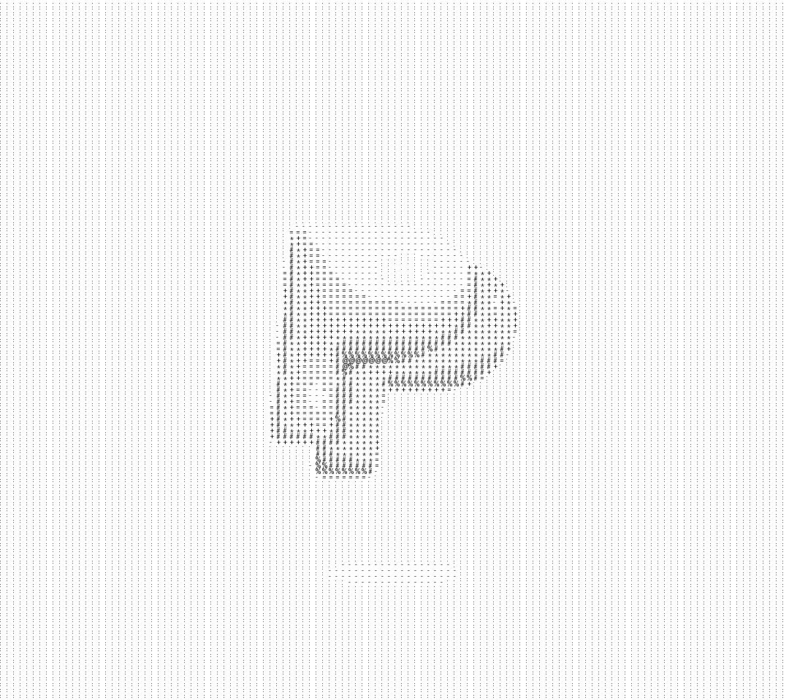

# img2ascii

**Version:** 1.1.0
**License:** MIT

## Overview

img2ascii is a Python library and command-line tool for converting images to ASCII art. It supports loading images from local files or URLs, offers different character sets for varying levels of detail, and provides flexible scaling options. This project is more of a personal exploration than a professional utility, but it aims to be robust and easy to use.

## Features

* Load images from local files or URLs
* Two character sets (simple and advanced)
* Adjustable scaling for different detail levels
* Option to save ASCII art as an image with overwrite protection

## Installation

To install the library, simply run:

```bash
pip install .
```

## Usage

You can use img2ascii either as a library in your Python scripts or as a standalone CLI tool.

### CLI Usage

The tool can be run directly from the terminal once installed. Here are some common usage examples:

* Convert a local image and print ASCII to terminal:

```bash
img2ascii -f /path/to/image.jpg
```

* Convert an image from a URL and print to terminal:

```bash
img2ascii -u https://example.com/image.png
```

* Save ASCII art as an image file:

```bash
img2ascii -f /path/to/image.jpg -o ascii_art.png
```

* Use the advanced character set and lower detail:

```bash
img2ascii -f /path/to/image.jpg -a -s 4
```

* Overwrite existing output files:

```bash
img2ascii -f /path/to/image.jpg -o ascii_art.png --overwrite
```

### Library Usage

* Import and create instance - required to use
```python
from img2ascii import ImgConverter

conv = ImgConverter()
```

* Loading an image
```python
conv.load_from_file("/path/to/image.png") # Load from local file
conv.load_from_url("https://example.com/image.png") # Load from url
```

* Get results
 
```python
img_array = conv.get_array() # As numpy array
img_string = conv.get_string() # As string ready for printing
conv.print_ascii() # Print
conv.save_to_img() # Save as image
```

## Example Results

#### Input image
<br>
Photo by <a href="https://unsplash.com/@farhat099?utm_content=creditCopyText&utm_medium=referral&utm_source=unsplash">Farhat Altaf</a> on <a href="https://unsplash.com/photos/a-blue-object-floating-in-the-air-fQ4ESXr-pNI?utm_content=creditCopyText&utm_medium=referral&utm_source=unsplash">Unsplash</a>

### Scaling
* Scale 2
<br><br>

* Scale 4
<br><br>

* Scale 6
<br><br>

### Character sets
* Simple set
<br><br>

* Advanced set
<br><br>

## Error Handling

Custom exceptions are used for clear error messages:

* `ImageNotLoadedError`: No image loaded.
* `InvalidURLError`: Invalid URL format.
* `UnsupportedExtensionError`: Unsupported file extension.
* `ImageDownloadError`: Failed to download image.
* `TargetExistsError`: Output file already exists.

## Contributing

Feel free to fork this project and make pull requests if you find bugs or have ideas for new features.

## License

This project is licensed under the MIT License. See the LICENSE file for details.
